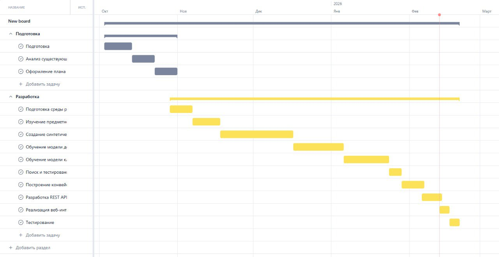
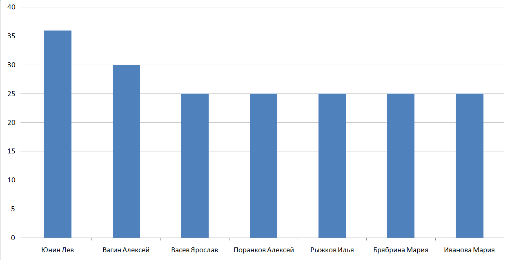

Программный модуль автоматизированной обработки документов абитуриентов
Автор: Вагин Алексей
Проектная школа МГТУ им. Г.И. Носова

ОПИСАНИЕ ПРОЕКТА

Данный репозиторий содержит материалы проектной работы по созданию системы распознавания документов (паспорт, СНИЛС, документы об образовании). Система разрабатывается для автоматизации ввода данных в приемной комиссии вуза. Главная особенность — работа в локальном контуре без передачи данных в интернет.

Здесь размещена документация по управлению проектом и демонстрационный скрипт интерфейса. Основные модели машинного обучения разрабатываются в отдельном репозитории.

УПРАВЛЕНИЕ ПРОЕКТОМ

1. График выполнения работ
Ниже представлен план-график реализации проекта от этапа анализа до прототипа.
(см. файл gantt.png в файлах репозитория)

2. Ресурсный план
В команде работает 7 человек. Распределение времени между участниками представлено на графике ниже. Основное время затрачено на обучение нейросетей и проектирование.
(см. файл resources.png в файлах репозитория)

ДЕМОНСТРАЦИЯ (ИНТЕРФЕЙС)

Для проверки работы системы написан скрипт run.py. Он запускает веб-интерфейс, где можно загрузить изображение документа.

Как запустить:

1. Установите необходимые зависимости:
pip install gradio opencv-python pandas docreader-ocr==0.2.3

2. Запустите основной скрипт:
python app.py

3. Интерфейс будет доступен в браузере по локальному адресу: http://127.0.0.1:7860
